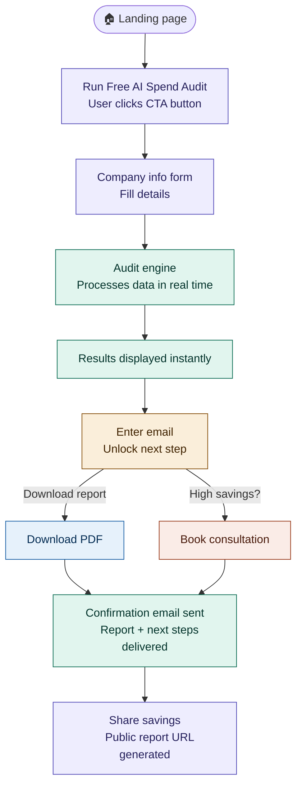
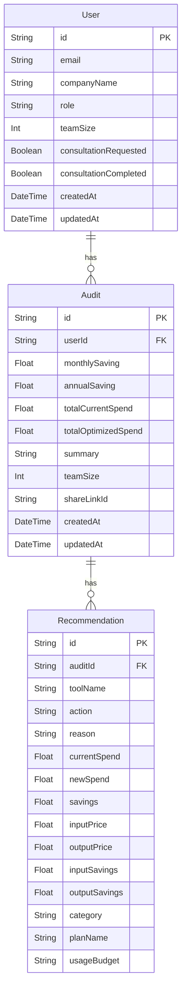
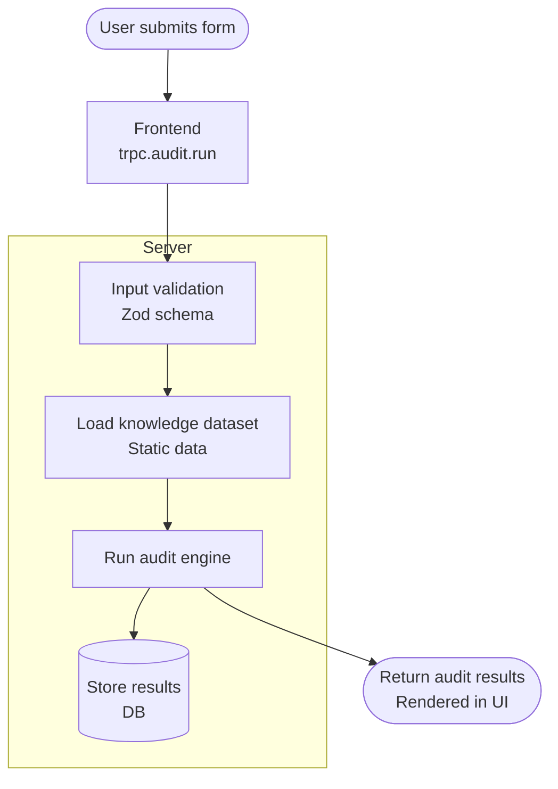
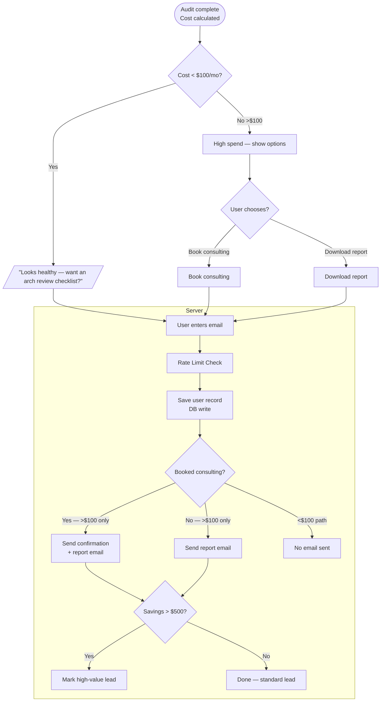

# Architecture.md — AI Spend Audit (Credex)

## Product Summary

This is a free web application that audits a startup’s AI tool spend and instantly shows:

* Where they are overspending
* Which plans or tools to switch to
* Total monthly and annual savings

It delivers value immediately and creates a qualified lead path through a shareable report and optional consultation.

---

## Data Flow

1. User visits the app and completes the audit form with AI tools, monthly spend, team size, and use case.
2. Frontend validates input and sends it to the backend via `tRPC`.
3. The backend audit engine loads rules and knowledge data, then evaluates each tool against plan pricing, usage patterns, and cheaper alternatives.
4. The audit engine computes itemized recommendations, savings, and rationale.
5. Results are returned to the frontend and rendered as:
   * tool-by-tool recommendations
   * total monthly/annual savings
   * benchmark comparison and summary copy
6. If the user opts in, the app stores lead details in the database and generates a shareable report URL.

This flow ensures user input is transformed into a deterministic audit result within a single request/response cycle, with optional persistence for lead capture and sharing.

---

## Tech Stack and Why It Was Chosen

### Next.js
* Provides built-in routing, server rendering, and API handling in one framework.
* Keeps frontend and backend logic co-located for faster iteration.
* Works smoothly with Vercel and modern JAMstack deployment.

### TypeScript
* Adds compile-time safety across UI, API, and database code.
* Reduces runtime errors in a product that makes recommendation logic visible to users.
* Improves maintainability for future audit rule expansion.

### tRPC
* Enables end-to-end typed communication between React components and backend handlers.
* Avoids writing boilerplate REST endpoints or OpenAPI contracts.
* Simplifies data validation and refactoring.

### PostgreSQL
* Reliable relational store for audit inputs, report share links, and lead records.
* ACID guarantees ensure saved reports and leads are consistent.
* Scales well vertically and with modern serverless-friendly hosted providers.

### Drizzle
* Provides type-safe database access and migrations.
* Makes schema changes and query composition easier than raw SQL.
* Fits well with the TypeScript-first stack.

### Tailwind CSS
* Speeds UI development and keeps the UI consistent.
* Eliminates custom CSS complexity for MVP styling.

### Vercel
* Zero-config deployment for Next.js apps.
* Automatic CI/CD and preview deployments from GitHub.
* Good fit for a startup MVP with serverless functions and global CDN.

---

## Handling 10k Audits/Day

If this product needed to handle 10k audits per day, I would make these changes:

1. Separate audit processing from request handling
   * Use a lightweight request queue or job processor for audit analysis.
   * Return a fast response immediately and update results asynchronously if needed.

2. Cache repeated audit results
   * Cache common tool/package combinations and benchmarking responses.
   * Reuse static rule and pricing data across requests.

3. Add a dedicated analytics and persistence layer
   * Move leads, reports, and audit history to a scalable managed database.
   * Use read replicas or partitioning for heavy read workloads.

4. Scale the backend
   * Run the API on auto-scaled serverless functions or containerized services.
   * Use a database tier that supports high-concurrency read/write workloads.

5. Improve observability and error handling
   * Add logging, metrics, and tracing for audit throughput, latency, and failures.
   * Monitor queue depth, request duration, and database performance.

6. Harden the audit engine
   * Convert rule evaluation to a more efficient pipeline and avoid repeated computations.
   * Normalize tool/pricing data and use precomputed savings formulas.

These changes keep the current stack while shifting the architecture to support higher throughput, better caching, and more robust service scaling.

---

## Key Architecture Decisions

* Keep the audit engine as a deterministic backend service to maintain consistent recommendations.
* Use `tRPC` to minimize integration friction and preserve type safety.
* Choose PostgreSQL for structured lead and report data, with Drizzle for developer ergonomics.
* Host on Vercel for fast prototyping and deployment while retaining the option to move to a more dedicated backend if scale demands it.

---

## Future Improvements

* Add a dedicated job queue or serverless worker for high-volume audit processing.
* Implement rate limiting and API protection for shared report generation.
* Introduce a metrics dashboard for usage, savings impact, and lead conversion.
* Expand the audit knowledge base to support additional AI tools and spending patterns.

* Linting
* Tests on every push to main

---

# User Flow

1. User lands on the landing page
2. Clicks **Run Free AI Spend Audit**
3. Fills company information
4. Audit engine processes data
5. Results are displayed instantly
6. User enters email to:
   * Download report, or
   * Book free consultation (if high savings)
7. Confirmation email is sent
8. User can share the savings via public report URL

---
# Database Design

---

# Detailed Data Flow

## Audit generation 

1. User submits form.
2. Frontend calls trpc.audit.run.
3. Server performs:
    * Input validation (Zod)
    * Load static knowledge dataset
    * Run audit engine
    * Store results in DB
4. Return audit results to UI.

# Email Unlock Flow

1. For audits showing cost <$100/mo show - You’re spending looks healthy want a deeper architecture review checklist
2. For above it give them option to book consulting or download report to cature email
4. User enters email.
5. Server:
    * Performs rate limit check
    * Saves user record
    * Sends confirmation email with report for people who have booked cosulting
    * Sends report who havent booked consulting cost >$100/mo
    * Marks high-value leads if savings > $500

# Caching Strategy
Because the dataset is static:

| Layer               | Strategy                  |
| ------------------- | ------------------------- |
| Knowledge dataset   | In-memory cache           |
| Public report pages | Edge caching (Vercel CDN) |
| tRPC responses      | No caching                |

# Security Architecture
## Input Security
* Zod validation for all API inputs
* Server-side validation only (never trust client)
## Abuse Prevention
* Rate limiting on all API endpoints
* Protection for email submission and shared report generation
## Data Protection
* No passwords stored
* Only business email + company info
* HTTPS enforced by Vercel
## Secrets Management
* Environment variables stored in Vercel

# Performance Strategy
## Key Optimizations
### Server
* Server Components by default
* Streaming SSR for results page
* Edge rendering for public reports
### Client
* Minimal JS bundle
* Tailwind tree-shaking
* Image optimization
### Database
Indexes required:

| Table | Index       |
| ----- | ----------- |
| User  | email       |
| Audit | userId      |

# CI/CD Pipeline

GitHub Actions workflow must run on every push.
Pipeline steps:

1. Install dependencies
2. Type check
3. Lint
4. Run tests
5. Build Next.js app

Failure blocks deployment.

---

# Folder structure

├── src/
│   ├── app/
│   │   ├── audit/
│   │   │   └── page.tsx
│   │   ├── result/
│   │   │   └── [shareLinkId]/
│   │   │       └── page.tsx
│   │   ├── api/
│   │   │   └── trpc/
│   │   │       └── [trpc]/
│   │   │           └── route.ts
│   │   ├── layout.tsx
│   │   └── globals.css
│   ├── components/
│   │   ├── audit/
│   │   ├── landing/
│   │   ├── result/
│   │   ├── icons/
│   │   ├── Button.tsx
│   │   ├── Headers.tsx
│   │   ├── Input.tsx
│   │   └── Select.tsx
│   ├── db/
│   │   ├── index.ts
│   │   ├── relations.ts
│   │   └── schema.ts
│   ├── trpc/
│   │   ├── client.tsx
│   │   ├── init.ts
│   │   ├── query-client.ts
│   │   ├── server.tsx
│   │   └── routers/
│   │       ├── _app.ts
│   │       ├── audit.ts
│   │       └── user.ts
│   ├── server/
│   │   └── audit-engine/
│   │       ├── auditSummaryPrompt.ts
│   │       ├── engine.ts
│   │       ├── index.ts
│   │       ├── types.ts
│   │       ├── knowledge/
│   │       │   └── dataset.ts
│   │       └── rules/
│   │           ├── overspendDetector.ts
│   │           └── teamSizeOptimisePlan.ts
│   ├── tests/
│   │   ├── audit-engine/
│   │   │   ├── overspendDetector.test.ts
│   │   │   ├── runAudit.test.ts
│   │   │   └── teamSizeOptimisePlan.test.ts
│   ├── types/
│   │   └── audit.ts
│   └── middleware.ts
├── lib/
│   └── audit/
├── .github/
│   └── workflows/
│       └── ci.yml
├── package.json
├── tsconfig.json
└── next.config.ts

---