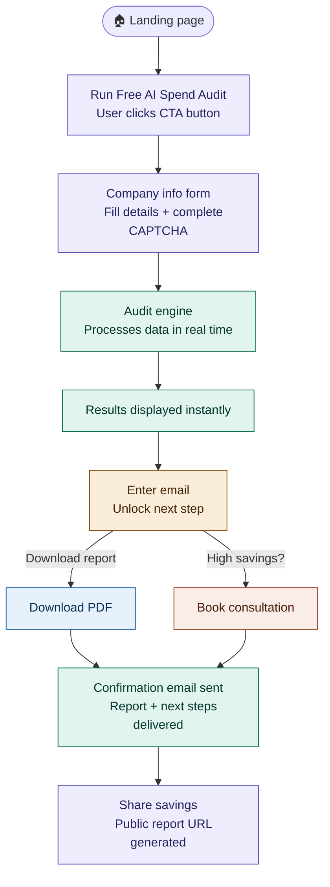
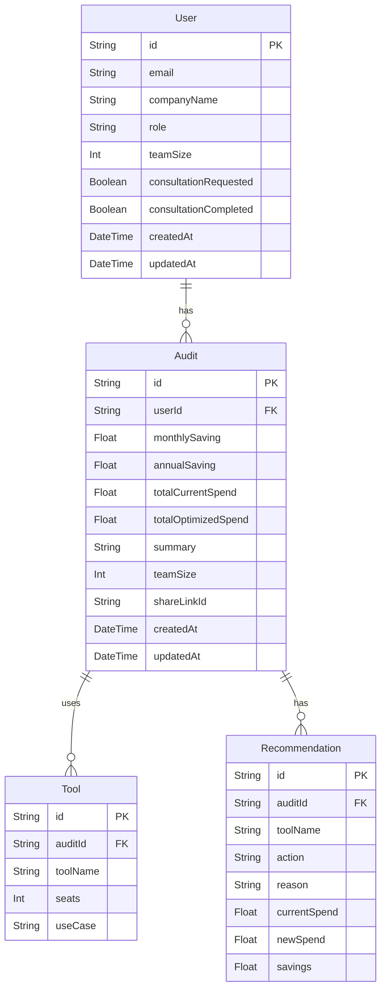

# Architecture.md — AI Spend Audit (Credex)

## Product Summary

This product is a free web application that audits a startup’s AI tool spending and instantly shows:

* Where they are overspending
* Which plans or tools they should switch to
* How much money they can save monthly and annually

After delivering value upfront, the app offers a **shareable report** and an **optional consultation**, helping companies optimize AI costs while generating qualified leads for Credex’s discounted AI infrastructure credits.

---

# Tech Stack

## Next.js
**Why**
* Built-in SSR, routing, and API layer
* Optimized for Vercel deployment
* Enables faster development

---

## TypeScript (Strict Mode)
**Why**
* Prevents runtime bugs via static typing
* Enables end-to-end type safety
* Makes APIs, database queries, and validation safer

---

## tRPC
**Why**
* End-to-end type safety between frontend and backend
* No need to write REST endpoints or Swagger documentation
* Faster development with fewer integration bugs

---

## PostgreSQL (Neon)
**Why**
* Reliable and scalable relational database
* ACID compliance and strong ecosystem
* Works well with serverless deployment

---

## Prisma
**Why**
* Type-safe database access
* Easy schema migrations
* Excellent developer experience
* Tight integration with TypeScript and PostgreSQL

---

## Tailwind CSS
**Why**
* Rapid UI development
* Consistent design system
* Small CSS bundle size

---

## Vercel
**Why**
* Zero-configuration deployment for Next.js
* Global CDN and serverless functions
* Automatic CI/CD from GitHub
* Preview deployments for every commit
* Ideal for fast MVP shipping

---

# Features To Be Implemented

## Landing Page

* CTA button → “Run Free AI Spend Audit”
* Navigates to the form page

---

## Input Form

Collect:

* AI tools used
* Monthly spend
* Team size
* Primary use case
* Custom tool input (optional)

Requirement:

* Form state must persist across page reloads.

---

## On-Screen Audit Results

The results page must show:

### Audit Insights

* Where the company is overspending
* What to switch or downgrade
* Total potential monthly and annual savings

### UI Requirements

For each tool:

* Current spend
* Recommended action
* Spend after recommendation
* Savings amount
* One-sentence reason

Summary section:

* Total monthly savings
* Total annual savings
* AI-generated summary (with fallback)

### Benchmark Mode

Display comparison such as:

> “Your AI spend per developer is X — companies your size average Y.”

---

## Email Registration

Capture:

* Email
* Company name
* Role
* Team size

### Lead Qualification Rule

If savings > **$500/month**:

* Offer option to book consultation
* Mark as high-value lead
### Email Workflow

* Send transactional confirmation email
* Inform user that Credex will reach out for high-savings cases

### Security

* hCaptcha required
* Prevent abuse and bot submissions

---

## Audit Engine Requirements

The audit engine uses a **static knowledge dataset** and must determine:

1. Are users on the correct plan for their usage?
2. Is there a cheaper plan from the same vendor?
3. Is there a significantly cheaper alternative tool with similar capabilities?

---

## Shareable Report URL

Must support:

* Open Graph tags for link previews
* Public page showing tools and savings numbers

---

## Performance Requirements

Lighthouse mobile scores on deployed URL:

* Performance ≥ 85
* Accessibility ≥ 90
* Best Practices ≥ 90

---

## Testing Requirements

* Minimum **5 tests** for the audit engine
* **80% test coverage**
* GitHub Actions CI workflow:

`.github/workflows/ci.yml`

Pipeline must run:

* Linting
* Tests on every push to main

---

# User Flow

1. User lands on the landing page
2. Clicks **Run Free AI Spend Audit**
3. Fills company information and completes CAPTCHA
4. Audit engine processes data
5. Results are displayed instantly
6. User enters email to:
   * Download report, or
   * Book free consultation (if high savings)
7. Confirmation email is sent
8. User can share the savings via public report URL

---
# Database Desgin

---

# Detailed Data Flow

## Audit genration 

1. User submits form.
2. Frontend calls trpc.audit.run.
3. Server performs:
    * Input validation (Zod)
    * Load static knowledge dataset
    * Run audit engine
    * Store results in DB
4. Return audit results to UI.

# Email Unlock Flow

1. For audits showing cost <$100/mo show - You’re spending looks healthy want a deeper architecture review checklist
2. For above it give them option to book consulting or download report to cature email
4. User enters email.
5. Server:
    * Verifies hCaptcha
    * Saves user record
    * Sends confirmation email with report for people who have booked cosulting
    * Sends report who havent booked consulting cost >$100/mo
    * Marks high-value leads if savings > $500

# Caching Strategy
Because the dataset is static:

| Layer               | Strategy                  |
| ------------------- | ------------------------- |
| Knowledge dataset   | In-memory cache           |
| Public report pages | Edge caching (Vercel CDN) |
| tRPC responses      | No caching                |

# Security Architecture
## Input Security
* Zod validation for all API inputs
* Server-side validation only (never trust client)
## Abuse Prevention
* hCaptcha on email submission
## Data Protection
* No passwords stored
* Only business email + company info
* HTTPS enforced by Vercel
## Secrets Management
* Environment variables stored in Vercel

# Performance Strategy
## Key Optimizations
### Server
* Server Components by default
* Streaming SSR for results page
* Edge rendering for public reports
### Client
* Minimal JS bundle
* Tailwind tree-shaking
* Image optimization
### Database
Indexes required:

| Table | Index       |
| ----- | ----------- |
| User  | email       |
| Audit | userId      |

# CI/CD Pipeline

GitHub Actions workflow must run on every push.
Pipeline steps:

1. Install dependencies
2. Type check
3. Lint
4. Run tests
5. Build Next.js app

Failure blocks deployment.